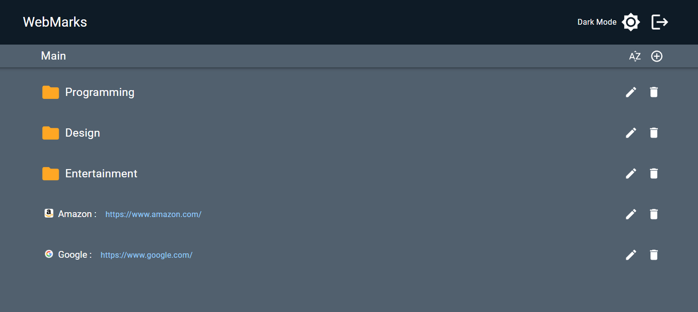

# Webmarks



#### Top Technologies

[](#)
[](#)
[](#)
[](#)
[](#)

Webmarks is an online file system that allows users to store folders and urls on the web. I built the server API using Node with Express and handled the user authentication with Passport.

The project is currently live on the web at : [https://webmarks.netlify.app](https://webmarks.netlify.app/)

## Frontend

The Frontend for this application was built using React and Material UI. The codebase can be viewed on the github repository below. :arrow_down:

:white_square_button: [Webmarks Frontend](https://github.com/ElierHP/webmarks)

## Installation - Backend

1. Download repository

   ```bash
   git clone https://github.com/ElierHP/webmarks-server.git
   ```

2. Install packages

   ```bash
   npm install
   ```

3. Create a .env file
   ```bash
   DB_HOST=your-server
   SESSION_SECRET=your-secret
   BASE_URL=http://localhost:3000 or server url
   ```

## Installation - Frontend

1. Download repository
   ```bash
   git clone https://github.com/ElierHP/webmarks.git
   ```
2. Install packages
   ```bash
   npm install
   ```

## Start Application

1. run both frontend & backend applications
   ```bash
   npm start
   ```

#### :mailbox: Reach out to me!

- :email: elierporto@gmail.com
